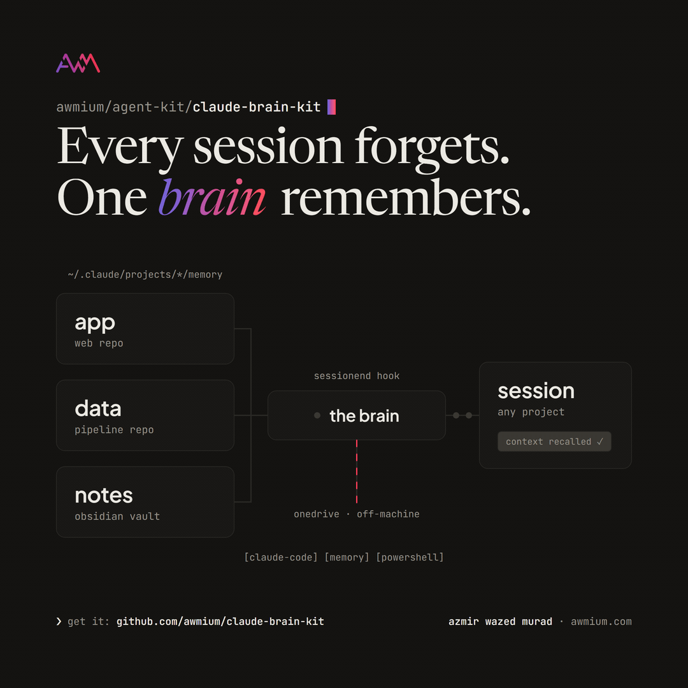

# claude-brain-kit

One brain for every Claude Code session.

Claude Code keeps per-project memory under `~\.claude\projects\<project>\memory\`. It works, but each project's memory is invisible to every other project, and none of it is backed up anywhere. This kit gives you a **Brain**: one folder, ideally inside OneDrive or any synced location, that becomes the consolidated master of all your Claude Code memory.



It is two small mechanisms:

1. A **SessionEnd hook** runs a PowerShell script that mirrors every project's memory folder into `Brain\projects\` at the end of each session. Deterministic backup, nothing to remember.
2. A block in your **global CLAUDE.md** teaches every session, in every project, to read cross-project facts from `Brain\global\` and to write new cross-project facts there.

The per-project folders stay the working copies Claude Code loads. The Brain is the human-browsable master, and your sync client carries it off-machine.

## Requirements

- Windows (the script uses robocopy; PowerShell 5.1 or 7+, both work)
- Claude Code with auto-memory active: check that `C:\Users\<you>\.claude\projects\` contains folders with a `memory\` subfolder
- A synced folder for the Brain (OneDrive recommended; an Obsidian vault works great, memory files are plain markdown and render natively)

## The fast way

Clone this repo, open Claude Code anywhere, and say:

```text
set up claude-brain-kit for me following the README at <path to this clone>,
my Brain should live at <folder of your choice>
```

Claude does the six steps below for you. The manual route follows.

## Setup

### 1. Create the Brain folders

Pick a home, for example a `Brain\` folder inside your OneDrive, and create:

```text
Brain\
  BRAIN.md        <- copy BRAIN-template.md from this kit, fill in your paths
  global\         <- cross-project memories live here, written by you and Claude
  projects\       <- machine-managed mirrors, the hook owns this folder
```

### 2. Install the backup script

Copy `brain-backup.ps1` to `C:\Users\<you>\.claude\scripts\`. Open it and set `$brainRoot` at the top to your Brain folder. Optionally add entries to `$friendlyNames` so mirrors get readable folder names instead of the raw sanitized project path.

### 3. Test it once

```powershell
powershell -NoProfile -ExecutionPolicy Bypass -File "C:\Users\<you>\.claude\scripts\brain-backup.ps1"
```

Check that `Brain\last-backup.txt` exists and `Brain\projects\` contains one folder per project that has memories. Empty memory folders and worktree projects are skipped on purpose.

### 4. Add the SessionEnd hook

Merge the contents of `settings-hook-snippet.json` into `C:\Users\<you>\.claude\settings.json`. If a `hooks` or `SessionEnd` key already exists, append the entry to the existing array, do not replace it. Fix the script path for your username. PowerShell 7 users can point `command` at `pwsh.exe` instead.

Validate afterwards, because a malformed settings.json silently disables everything in it:

```bash
jq . "C:\Users\<you>\.claude\settings.json"
```

### 5. Add the CLAUDE.md block

Append the contents of `claude-md-block.md` to `C:\Users\<you>\.claude\CLAUDE.md` (create the file if it does not exist) and replace the placeholder path with your Brain folder. This is what makes every future session recall from and write to the Brain.

### 6. Verify

Start a fresh Claude Code session (hooks and CLAUDE.md load at session start), do anything, and end it. `Brain\last-backup.txt` should show a new timestamp. Ask the new session "where does your global memory live?" and it should name your Brain.

## Rules of the system

- `Brain\global\` is the canonical home for anything that applies across projects: who you are, machine quirks, standing preferences, cross-project references. Use the standard memory frontmatter (name, description, metadata.type) so files work in both worlds.
- `Brain\projects\` is written only by the hook. It is a true mirror (robocopy /MIR): manual edits there get overwritten, and a memory deleted from a project's auto-memory disappears from the mirror at the next sync. That is intentional, wrong memories should not linger, and your sync client's version history is the recovery path for accidents.
- Seed `global\` by copying your clearly machine-wide memories out of your biggest project's memory folder. When a fact lives in both places, update `global\` first, then refresh the project copy.

## What it does not do

- It does not change what Claude Code auto-loads. Each session still loads only its own project's memory index; the Brain adds instructed recall on top, it cannot inject a second memory directory.
- It does not sync anything itself. Off-machine backup is your sync client's job; the kit just puts the Brain where the sync client can see it.
- It does not run on macOS or Linux as-is (robocopy). The script is forty lines; an rsync port is straightforward.

## Files

| file | what |
|---|---|
| `brain-backup.ps1` | the mirror script the hook runs |
| `settings-hook-snippet.json` | the SessionEnd hook block to merge into settings.json |
| `claude-md-block.md` | the recall and write rules for your global CLAUDE.md |
| `BRAIN-template.md` | the Brain's self-documenting index note |

## Troubleshooting

- **Hook never fires:** hooks load at session start. Restart Claude Code or open `/hooks` once, then check settings.json parses (step 4).
- **Nothing mirrored:** the script skips memory folders with zero files and any project whose folder name contains `-worktrees-`.
- **Ugly folder name under projects\\:** add the raw name to `$friendlyNames` in the script; the next run creates the friendly folder (delete the old one).

## License

MIT. Built by [Awmium](https://awmium.com).
